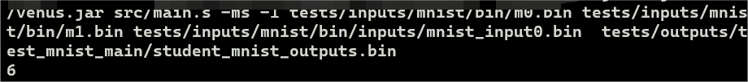

# 使用RISC-V编写函数完成了一个数字识别神经网络

[项目来源——CS61C](https://inst.eecs.berkeley.edu/~cs61c/su20/)

>主要的coding部分在src目录下
>
>tests目录存放一些测试用例
>
>tools存放汇编工具

## 内容介绍

项目用RISC-V语言实现了relu模块
argmax模块熟悉了一些基本概念

先实现了点乘dot模块，再在此基础上实现了
矩阵乘法matmul模块

utils模块是一些基本汇编语言输入输出的方法

write_matrix模块即利用汇编语言实现双重循环遍历矩阵

classify模块是对以上实现模块的一个综合调用

debug模块是个人完成汇编代码编写的测试代码的repository

main模块主要完成各个模块的import以及接口的跳转

主要实现框架如图

## 完成效果

对于如下图的二进制流

使用命令

    java -jar tools/venus.jar src/main.s -ms -1 tests/inputs/mnist/bin/m0.bin tests/inputs/mnist/bin/m1.bin tests/inputs/mnist/bin/inputs/mnist_input0.bin  tests/outputs/test_mnist_main/student_mnist_outputs.bin
    
识别结果

## 项目总结

代码量对于汇编代码来说很少，大概只有500行

但是项目非常有意思，写汇编代码更能锻炼写代码的专注度

而且用汇编实现函数调用的过程，对于栈空间的分配是完全手动的，能够加深对汇编的理解。

实现过程中对函数参数寄存器、返回值寄存器、临时寄存器、保留寄存器的使用，帮助理解在寄存器方面的profiling。

在项目完成过程中，深刻体会到了对临时寄存器、保留寄存器以及返回地址寄存器的入栈出栈规则（caller,callee规则）的遵循可以让代码减少很多潜在的问题。

统一的代码规范是伟大的😀。
